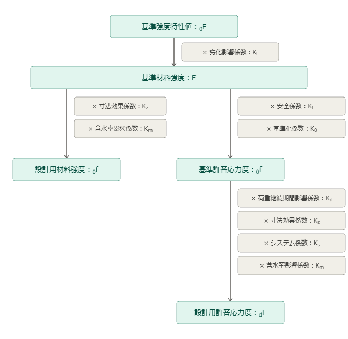
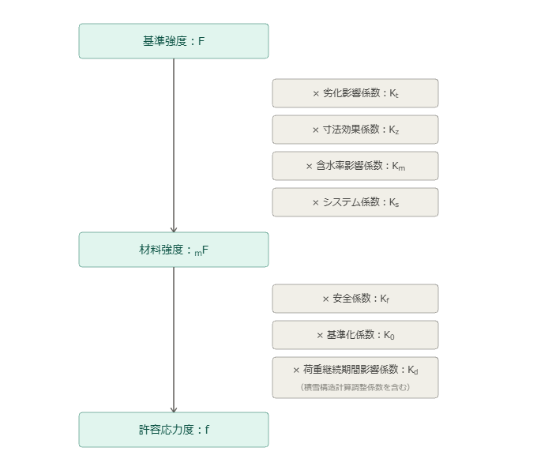

<!-- _class: lead -->

# AIJ 木質構造設計規準 改定 社内勉強会

## 第4章〜第6章：材料、部材設計、接合部設計

担当：大岩

---

<!-- _class: lead -->

# 第4章　構造用材料および設計用特性値

---

## 第4章　改定の方針

- **[改定]** 実務で使う用語と規準用語のずれを解消
  - 旧版の用語体系：建築基準法と異なる独自用語が複数あり、係数も複雑
  - 新版の用語体系：**建築基準法と用語を整合**、わかりやすさを重視

- **変更の軸となる用語対応**

| 2006年版（旧） | 2026年版（新） |
|---|---|
| 基準強度特性値（$_{0}F$） | 基準強度（$F$） |
| 基準材料強度（$F$） | （廃止・統合） |
| 設計用材料強度（$_{n}F$） | 材料強度（$_{m}F$） |
| 設計用許容応力度（$_{n}f$） | 許容応力度（$f$） |
| 基準弾性特性値 | 基準弾性係数（$E_0$，$G_0$） |

> 考え方・数値体系は旧版を踏襲。**用語・フロー整理が主眼**。

---

<!-- _class: flow-compare -->

## 用語体系の改定：強度算定フロー [改定]

2006年版（旧）

2026年版（新）

<ul class="flow-notes">
<li>旧版：係数の乗算経路が2系統に分岐して複雑</li>
<li>新版：<strong>一本のフローに統合</strong>し、係数の意味が把握しやすい構成に</li>
</ul>

---

## 402.3　材料強度（$_{m}F$）— 寸法効果係数の追加（１） [追加]

- **[追加]** 構造用製材（軸組材）の**材せい方向寸法効果係数**を新規設定
  - 旧版：集成材・枠組壁工法製材のみに寸法効果係数あり
  - 新版：実大材試験データに基づき、**製材（軸組材）にも追加**

**寸法効果係数 $K_z$ の算定式**

$$K_z = \left(\frac{h_0}{h}\right)^{k} \tag{402.2}$$

- $K_z$：寸法効果係数　／　$k$：寸法効果パラメータ
- $h$：使用する構造用材料のせい　／　$h_0$：標準（試験体）のせい

> ※ 標準のせい $h_0$ より小さいせいに対しては、寸法効果係数の割増を行わない。

---

## 402.3　材料強度（$_{m}F$）— 寸法効果係数の追加（２） [追加]

**表402.2　寸法効果パラメータと標準せい（抜粋）**

| 構造用材料の種類 | パラメータ $k$ | 標準せい $h_0$（mm） | 適用範囲（mm） |
|---|---|---|---|
| 製材（軸組材）[追加] | 0.4 | 150 | 150〜300超 |
| 製材（枠組材） | 0.4 | 89 | 89〜286 |
| 異等級構成集成材 | 1/9 | 300 | 300〜1800超 |
| 同一等級構成集成材 | 1/9 | 100 | 100〜300超 |
| 構造用LVL | 0.136 | 300 | 300〜1200 |

> ※ 基準法では定めがないため、**採用可否は設計者判断**。標準せい未満への割増なし。

---

<!-- _class: flow-compare -->

## 404.2　設計に用いる弾性係数 [改定]

2006年版（旧）

基準弾性係数　E0, G0

× 含水率の剛性調整係数　Km

設計に用いる弾性係数　E, G

＜変形重視・圧縮力に単独で働く主要材＞

× 下限値調整係数　Kl

E0.05

2026年版（新）

基準弾性係数　E0, G0

× 含水率の剛性調整係数　Km

× 事故的水掛かり　Kac　[追加]

× クリープ　Kc　[追加]

設計に用いる弾性係数　E, G

＜変形重視・圧縮力に単独で働く主要材＞

× 下限値調整係数　Kl

E0.05

<ul class="flow-notes">
<li>旧版：剛性調整は<strong>含水率係数（Km）のみ</strong></li>
<li>新版：<strong>事故的水掛かり Kac・クリープ Kc</strong> を追加し、剛性低下要因を明示化</li>
</ul>

---

## 404.2　設計に用いる弾性係数 — 調整係数の追加 [改定]

**【弾性係数の調整係数】[追加]**

旧版の含水率・下限値調整係数（$K_m$・$K_l$）に加え、新係数を追加：

- **$K_{ac}$（事故的な水掛かりを考慮した剛性調整係数）** [追加]
  - 施工中降雨・竣工後雨水侵入等による含水率上昇を想定
  - 実験等に基づき設定
- **$K_{c}$（クリープの剛性調整係数）** [追加]
  - 長期荷重による**たわみ量の増加**を勘案
  - 「404.3 クリープ変形係数」に応じて決定

---

## 巻末設計資料 [更新]

**【巻末設計資料の主な更新内容】[追加・更新]**

- 機械等級区分製材の弾性係数基準値を更新
- 枠組壁工法製材に新たな樹種群（SYP・JSⅠ〜Ⅲ）・寸法型式を追加
- 構造用LVL を **A種・B種に区分**（B種：圧縮・引張・曲げ・せん断・めり込みを新規掲載）
- **CLT の強度特性値・弾性係数を新規掲載**
- 構造用製材・集成材・LVLの**寸法効果係数表**を新規掲載

---

<!-- _class: lead -->

# 第5章　部材の設計

---

## 第5章　改定の方針

- **章構成の変更なし**（501〜505の節番号・タイトルは同一）
- **主な改定点は2項目**

**① 503.2　単一圧縮材の座屈計算方法** [改定]
- 材料の5%下限弾性係数 $E_{b0.05}$ が判明している場合の計算式を明示追加
- 集成材・LVL等のJAS材はヤング係数が規格値として規定されているため対応

**② 504.3(5)　横座屈に関する許容応力度の低減** [改定]
- 横座屈係数 $C_k$ を**一定値（22.2）に統一**し、計算式を簡略化
- 旧版では $C_k$ の値により場合分けが必要、かつ $C_s = 10$ で不連続
- 多くの構造用材料で $C_k \approx 20$〜$25$ の範囲に収まることを確認して簡略化

> $C_k$：弾性／非弾性座屈の境界となる**限界の横座屈細長比** $\left(=\sqrt{0.6\,E_{by\text{-}y}/f_b}\right)$。$E/f$ がほぼ一定のため約 22.2 に集約できる。
> ⇒ 旧版の式に $C_k=22.2$ を代入して整理したもので、**一般的な材では補正係数 $C_b$（＝低減率）の数値は新旧でほぼ同等**（$C_s=10$ の不連続が解消される点が主な違い）。

---

## 503.2　単一圧縮材の座屈計算 [改定]

**改定後：2種類の計算式を材料ごとに適用**

$$\frac{N}{A} \cdot \frac{1}{f_k} \leq 1 \tag{5.2}$$

（5.2）式：$E_{b0.05}$ 未判明材（製材等）に適用

$$\frac{N}{A} \cdot \frac{1}{F_k \cdot K_d/3} \leq 1 \tag{5.3}$$

（5.3）式：$E_{b0.05}$ 既知材（集成材・LVL等）に適用

**座屈強度 $F_k$ の計算式（[改定]・$E_{b0.05}$ 使用を明示）**

| 細長比 $\lambda$ | $F_k$ の式 |
|---|---|
| $\lambda \leq 30$ | $F_k = F_c$ |
| $30 < \lambda \leq 100$ | 線形補間 $\{(\lambda-30)F_{kp}-(\lambda-100)F_c\} / 70$ |
| $100 < \lambda$ | $\pi^2 E_{b0.05} / \lambda^2$ |

> ここで $F_{kp} = \pi^2 E_{b0.05} / 100^2$。CLT は本節の対象外。

---

## 504.3(5)　横座屈補正係数 $C_b$ の改定 [改定]

**Before（旧版）：$C_k$ の値により場合分け・$C_s = 10$ で不連続**

$$C_b = \begin{cases} 1.00 & (C_s \leq 10) \\ 1.27 - 0.027C_s & (10 < C_s \leq C_k) \\ 0.4E_{by\text{-}y} / (C_s^2 \cdot f_b) & (C_k < C_s \leq 50) \end{cases}$$

**After（新版）：$C_k = 22.2$ 固定で一元化**

| 横座屈細長比 $C_s$ | 横座屈補正係数 $C_b$ |
|---|---|
| $C_s \leq 10$ | $1.00$ |
| $10 < C_s \leq 22.2$ | $1.27 - 0.027\,C_s$ |
| $22.2 < C_s \leq 50$ | $330 / C_s^2$ |

$$C_s = \sqrt{\frac{l_e \cdot h}{b^2}} \tag{5.16}$$

> $C_s > 50$ は不可。$E_{by\text{-}y}$（横方向曲げヤング係数）と $f_b$ の比率から $C_k \approx 22.2$ が導出される。

---

<!-- _class: lead -->

# 第6章　接合部の設計

---

## 第6章　改定の概要（章構成の変更） [移動]

| 旧節番号 | 旧タイトル | 新節番号 | 新タイトル |
|---|---|---|---|
| 601 | 総則 | 601 | 総則 |
| 602 | 曲げ降伏型接合具を用いた接合 | 602 | 曲げ降伏型接合具を用いた接合 |
| **603** | **胴付き・かん合接合** | **603** | **胴付き・かん合接合（旧604から移動）** |
| **604** | **接着接合** | **604** | **接着接合（旧605から移動）** |
| **605** | **グルーラムリベット等** | **605** | **その他の接合具を用いた接合（旧603から移動）** |
| 606 | 本規準にない接合 | 606 | 本規準にない接合 |
| — | — | **607** | **接合部に関する試験の原則（新設）** |

> 607 は試験対象（せん断・引抜き）と実施上の注意点を新規解説。

---

## 601　総則の主な改定 [改定][追加][削除]

**601.2　許容耐力・終局耐力・使用限界変形**

- **[追加]** 接合部の**降伏耐力**に関する記述を追加
- **[追加]** 接合部の**靭性に基づく種別（JA〜JC）**に関する記述を追加

**601.3　基準密度と対応樹種**

- **[改定]** 基準密度の単位を（kg/m³）形式に統一
- **[追加]** J2グループに **おうしゅうあかまつ** を追加

**601.9　多数の接合具を使う場合の許容耐力の低減**

- **[削除]** 千鳥配置についての記述を削除（602.1解説へ移行）

**601.11　共通的な注意事項**

- **[追加]** 個々の接合部に生じる応力の方向・大きさが異なる場合の記述を追加

---

<!-- _class: flow-compare -->

## 602.1　一般事項 ① 体系の抜本的整理 [改定][削除]

2006年版（旧）

単位接合部の終局耐力

× 靭性係数 jKr（脆性接合部を低減）

基準終局せん断耐力 P0

× 1/3 ・ jKd ・ jKm

許容せん断耐力 Pa

※ 単位接合部と接合部【全体】を区別して計算

2026年版（新）

終局せん断耐力 P0 = min(Puj, Puw)

× 1/3 ・ jKd ・ jKm

靭性係数 jKr は削除　[削除]

許容せん断耐力 Pa

※ 単位接合部を廃止し一元化／接合種別 JA〜JC は存続

<ul class="flow-notes">
<li>旧版：単位接合部を区別し、<strong>靭性係数 jKr</strong> で脆性接合部の耐力を直接低減</li>
<li>新版：計算を一本化し、脆性は <strong>Rf2 による応力割増し設計</strong> に移行（種別 JA〜JC が根拠）</li>
</ul>

---

## 602.1　一般事項 ② 接合形式係数 $C$ の改定 [改定][追加]

**$M_p$（全塑性曲げモーメント）の使用を解禁**

$$R = \begin{cases} \dfrac{4M_p}{F_e \cdot d \cdot l^2} & (M_p\ \text{既知}) \\[6pt] \dfrac{2F}{3F_e} \cdot \left(\dfrac{d}{l}\right)^2 & (F\ \text{既知}) \end{cases} \tag{6.6}$$

- 上段：実験等により全塑性曲げモーメント $M_p$ が既知の場合
- 下段：接合具の基準強度 $F$ が既知の場合（旧版はこちらのみ）

**支圧強度の改定** [改定]

- Eurocode 5 の式を採用し、**繊維直角方向の値を若干増大**
- 繊維方向：$F_{e\parallel} = \{34,\, 30,\, 26\}_{J1,J2,J3} \times (1 - 0.01d)$（N/mm²）
- 繊維直角方向：$F_{e\perp} = F_{e\parallel} / (1.35 + 0.015d)$

---

## 602.1　一般事項 ③ CLT・異方性材料への対応 [追加]

**厚さ方向の支圧強度が異なる材料（CLT・B種LVL等）への対応**

- **[追加]** 精緻計算：厚さ方向に異なる支圧強度を考慮した接合形式係数の計算式
- **[追加]** 簡易計算：支圧強度を面積比率で按分

$$F_e = \frac{\sum_i F_{ei} \cdot t_i}{\sum_i t_i} \tag{602.1.5}$$

**集合型せん断破壊の拡張** [追加]

- 1面せん断接合形式に適用拡大（旧版は2面せん断のみ）
- 底部にせん断面が形成される場合の計算式を追加
- CLTを用いた場合の集合型せん断破壊の計算式を追加

**剛性係数の追加** [追加]

- クリアランスを考慮した剛性係数 $k_j$ の計算式（6.22〜6.30）を新規追加
- 平井・小松式による支圧剛性 $k_0$ の採用

---

## 602.2〜602.4　各接合の改定 [改定]

**602.2　ボルト接合**

- **[追加]** 座金に関する記述を充実
- **[改定]** せん断を受けるボルトの配置条件を一部変更（縁端部 $e_2$ 等）
- **[改定]** 許容引張耐力を**有効断面積**を用いた計算式に変更

**602.3　ドリフトピン接合**

- **[改定]** ドリフトピンの品質・形状の記述を更新
- **[追加]** 適用できる接合形式の図を追加（二面せん断木材側材・鋼板挿入・一面せん断）

**602.4　ラグスクリュー接合**

- **[改定]** 本数による耐力低減係数（$_{j}K_{n}$）を**ボルトと同じ規則**に統一
- **[改定]** 許容引抜耐力を**密度依存式**に変更、安全係数を 2/3 に統一（応力割増率 4/3 で旧版相当）
- **[追加]** 側材に木材を用いる場合、ボルトの引張耐力式を併用する形式に

---

## 602.5　釘接合 ／ 602.6　ビス接合 の改定 [改定][追加][削除]

**602.5　釘接合**

- **[改定]** 終局せん断耐力 $P_{uj}$ の計算式を整理
- **[削除]** くぎを貫通させて折り曲げる場合の規定を削除
- **[改定]** 許容引張耐力を密度依存式に変更
- **[改定]** 接合種別（JA〜JC）の判定を**降伏モードに応じた形式**に変更

**602.6　ビス接合（旧：木ねじ接合）**

- **[改定]** 適用範囲を拡大：呼び径3〜12mm、基準強度または $M_p$ が既知で脆性破壊なし
- **[追加]** 有効直径 $d_{ef}$ の定義：谷径×1.1 と 円筒部径 のうち小さい方
- **[改定]** 支圧強度・低減係数：**有効直径 $d_{ef}$** で判定（6mm 以下は釘ルール、6mm 超はボルトルール）
- **[改定]** 配置間隔：**呼び径 $d$** で判定（6mm 以下は釘ルール、6mm 超はボルトルール）
  - ⚠ 判定に用いる**径の取り方が異なる**（支圧＝有効直径／配置＝呼び径）。有効直径＜呼び径の場合、呼び径 6.5〜8mm 付近で適用ルールが食い違う点に注意
- **[改定]** 許容引抜耐力の計算式を変更（安全率を 2/3 に変更）

---

## 602.6　ビス接合　引抜耐力の改定 [改定]

**許容引抜耐力の計算式**

$$p_a = \frac{1}{3} \cdot {}_{j}K_{d} \cdot {}_{j}K_{m} \cdot p_w \tag{6.43}$$

$$p_w = 93.7 \cdot \left(\frac{\rho_0}{1000}\right)^{1.35} \cdot d^{0.66} \cdot l_r \tag{6.44}$$

**Before / After 比較**

| 項目 | 旧版 | 新版 | 備考 |
|---|---|---|---|
| 終局耐力 $p_w$ | $38.1(\rho_0/1000)^{1.5}\,d\,l_r$ | $93.7(\rho_0/1000)^{1.35}d^{0.66}l_r$ | ビス全般のデータで再フィット |
| 安全係数 | $1/2$ | $\mathbf{2/3}$ | 応力割増し設計を前提として緩和 |
| 旧版相当に戻す場合 | — | 応力割増率を $4/3$ 倍として計算 | 従来設計との整合確認 |

> **方向性**：許容耐力は**上がる方向（緩和）**。安全係数 $1/2\to2/3$ で約 $4/3$ 増。ただし**応力割増し設計が前提**で、$4/3$ の割増しを行えば従来同等。

---

## 第6章　まとめ

**改定の要点（3点）**

1. **計算体系の整理**：単位接合部廃止・靭性係数（$_{j}K_{r}$）削除により、計算フローを簡略化。接合種別（JA〜JC）は存続し応力割増し（$R_{f2}$）と連動。

2. **CLT・異方性材料への対応**：支圧強度の面積按分、集合型せん断破壊の拡張計算式を追加。大断面木質構造で直接活用可能。

3. **ビス接合の体系化**：旧「木ねじ」から大幅拡張。有効径・配置の閾値（6mm/6.5mm）が異なる点は設計時に要注意。

**その他の変更**

- 剛性係数の計算式（6.22〜6.30）が新規追加：変形・振動設計に活用可能
- 607節「接合部に関する試験の原則」を新設：性能確認試験の考え方を明記

---

## 参考：用語・略語の統一

| 略語 | 意味 |
|---|---|
| [本] | 本文の改定 |
| [解] | 解説の改定 |
| $R_{f1}$ | 地震荷重割増率 |
| $R_{f2}$ | 地震時応力割増率 |
| JA〜JC | 接合種別（靭性クラス） |
| CLT | 直交集成板（Cross Laminated Timber） |
| LVL | 単板積層材（Laminated Veneer Lumber） |
| $E_{b0.05}$ | 曲げの基準弾性係数の95%下側許容限界値 |
| $M_p$ | 全塑性曲げモーメント |
| $_{j}K_{r}$ | 靭性係数（**今版より削除**） |
